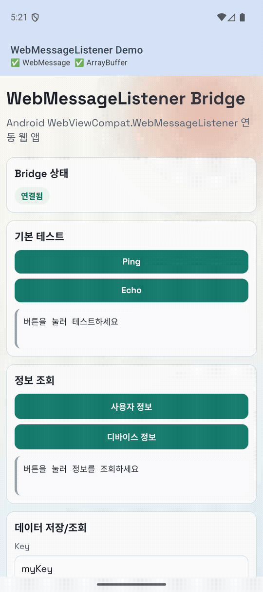

# Android WebMessageListener Guide

Android 개발자를 위한 `WebViewCompat.WebMessageListener` 기반 웹-네이티브 통신 가이드입니다.

## Demo Video

[](docs/media/bridge-demo-20260216.mp4)
- [Full video (MP4)](docs/media/bridge-demo-20260216.mp4)

이 프로젝트의 핵심 목적:
- `addJavascriptInterface` 대신 더 안전한 메시지 기반 통신 사용
- WebView 안의 웹 페이지와 Android 간 양방향 통신 구현
- Origin 검증을 통한 보안 강화

## 1. 프로젝트 구조

- `android/`: Android 앱 본체 (WebView + Bridge)
- `web/`: 연동 대상 웹 프로젝트 (Android에서 로드)

이 문서는 Android 관점에서 필요한 내용만 다룹니다.

## 2. 현재 Android 핵심 파일

- 메인 화면/웹 로드: `android/app/src/main/java/io/github/kez/sample/web/message/listener/MainActivity.kt`
- WebView 컴포넌트: `android/app/src/main/java/io/github/kez/sample/web/message/listener/ui/components/SecureWebView.kt`
- 메시지 리스너: `android/app/src/main/java/io/github/kez/sample/web/message/listener/bridge/SecureWebMessageListener.kt`
- 메시지 모델: `android/app/src/main/java/io/github/kez/sample/web/message/listener/bridge/WebBridgeMessage.kt`
- 액션 처리기: `android/app/src/main/java/io/github/kez/sample/web/message/listener/bridge/WebBridgeHandler.kt`

## 3. 브리지 동작 개요

브리지 이름: `NativeBridge`

웹에서 요청(JSON 문자열) 전송:
- `NativeBridge.postMessage(JSON.stringify(request))`

Android에서 수신/처리 후 응답(JSON 문자열) 반환:
- `replyProxy.postMessage(responseJson)`

## 4. 메시지 규격

### 4.1 Request (웹 -> Android)

```json
{
  "id": "request-id",
  "action": "ping",
  "payload": {}
}
```

### 4.2 Response (Android -> 웹)

```json
{
  "id": "request-id",
  "success": true,
  "data": "{\"pong\":true}",
  "error": null
}
```

### 4.3 지원 액션 (`WebBridgeHandler` 기준)

- `ping`
- `echo`
- `getUserInfo`
- `getDeviceInfo`
- `saveData`
- `getData`

## 5. 원격 웹 배포 연동 시 변경 포인트

현재 예제는 로컬 자산(`file:///android_asset/demo.html`)을 로드합니다.

실서비스용으로 전환할 때:
1. `MainActivity.kt`에서 `url`을 배포 URL로 변경
2. `allowedOrigins`를 배포 도메인으로 제한

예시:

```kotlin
SecureWebView(
    url = "https://your-domain.com",
    allowedOrigins = setOf("https://your-domain.com"),
    onAction = { action, payload ->
        bridgeHandler.handleAction(action, payload)
    }
)
```

현재 프로젝트는 아래 운영값으로 이미 연결되어 있습니다.

- `PROD_WEB_URL`: `https://samplewebmessagelistener-web.pages.dev`
- `PROD_ALLOWED_ORIGINS`: `https://samplewebmessagelistener-web.pages.dev`

위 값은 `android/app/src/main/java/io/github/kez/sample/web/message/listener/bridge/WebBridgeConfig.kt`에서 관리합니다.

## 6. 보안 체크리스트

- 운영 환경에서 `allowedOrigins`를 최소 범위로 제한
- 와일드카드(`*`)는 개발 단계에서만 사용
- `isMainFrame` 검증 유지 (iframe 기반 공격 완화)
- 메시지 파싱 실패/알 수 없는 액션에 대해 명확한 에러 응답 유지

## 7. 트러블슈팅

- `NativeBridge not available`
  - 브리지 등록(`addWebMessageListener`) 성공 여부 확인
  - 웹 페이지 로드 시점과 브리지 주입 시점 확인
- 요청 타임아웃
  - 웹 `action` 문자열과 Android `when (action)` 항목 일치 여부 확인
- Origin 차단
  - `allowedOrigins`와 실제 URL의 scheme/host/port 완전 일치 확인

## 8. 공식 문서

- WebViewCompat: https://developer.android.com/reference/androidx/webkit/WebViewCompat
- WebViewCompat.WebMessageListener: https://developer.android.com/reference/androidx/webkit/WebViewCompat.WebMessageListener
- JavaScriptReplyProxy: https://developer.android.com/reference/androidx/webkit/JavaScriptReplyProxy
- WebMessageCompat: https://developer.android.com/reference/androidx/webkit/WebMessageCompat
- WebView 앱 가이드: https://developer.android.com/develop/ui/views/layout/webapps
- WebSettings 보안 가이드: https://developer.android.com/reference/android/webkit/WebSettings
